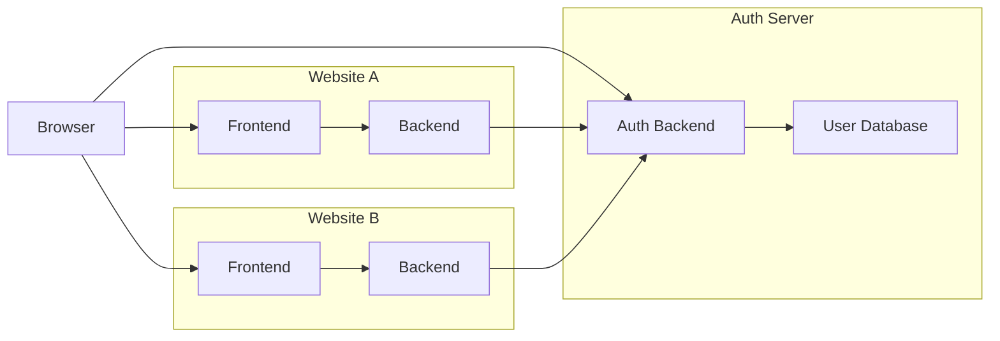
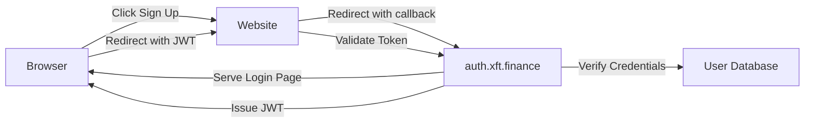

# XFT AUTH SERVER

### SEQUENCE
1. User visits Website A.
2. Website A redirects to Auth Server login.
3. User enters credentials on Auth Server.
4. Auth Server verifies, issues JWT, redirects to callback.
5. Website A validates JWT and sets session.
6. For Website B, existing Auth Server session reissues JWT for access.

### SYSTEM DESIGN

