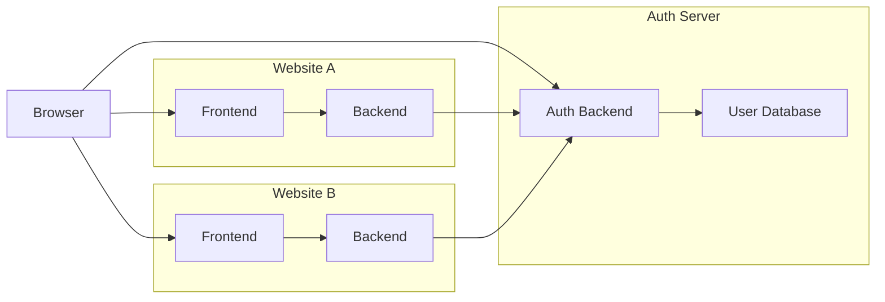
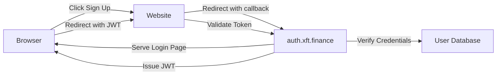

# XFT AUTH SERVER

- auth.xft.finance
- Use Express in index.js on replit for MVP.
- Create /login to display a basic login form.
- Create /auth to process credentials.
- Hardcode user credentials for prototype.
- Use jsonwebtoken for JWT sign/verify.
- On success, redirect with JWT via /callback.
- Validate JWT in protected endpoints.
- Keep all logic in index.js.


Here’s the complete `index.js` code for your `auth.xft.finance` server MVP, along with the required dependencies and a concise explanation of how it works.

---

### Dependencies
Install these via npm:
```bash
npm install express jsonwebtoken body-parser firebase firebase-admin
```
- **express**: Web framework for routing and server setup.
- **jsonwebtoken**: For signing and verifying JWTs.
- **body-parser**: Parses form data from requests.

---

### `index.js` Code
```javascript
const express = require('express');
const jwt = require('jsonwebtoken');
const bodyParser = require('body-parser');
const app = express();
const PORT = 3000;
const SECRET_KEY = 'your-secret-key'; // Replace with a secure key

// Hardcoded users for prototype
const users = [
  { id: 1, username: 'user1', password: 'password1' },
  { id: 2, username: 'user2', password: 'password2' },
];

// Middleware
app.use(bodyParser.urlencoded({ extended: true }));

// Login form route
app.get('/login', (req, res) => {
  const redirectUri = req.query.redirect_uri;
  if (!redirectUri) return res.status(400).send('Missing redirect_uri');
  res.send(`
    <form action="/auth" method="post">
      <input type="hidden" name="redirect_uri" value="${redirectUri}">
      <label>Username: <input type="text" name="username"></label><br>
      <label>Password: <input type="password" name="password"></label><br>
      <button type="submit">Login</button>
    </form>
  `);
});

// Authenticate and issue JWT
app.post('/auth', (req, res) => {
  const { username, password, redirect_uri } = req.body;
  const user = users.find(u => u.username === username && u.password === password);
  if (!user) return res.status(401).send('Invalid credentials');
  const token = jwt.sign({ id: user.id, username: user.username }, SECRET_KEY, { expiresIn: '1h' });
  res.redirect(`${redirect_uri}?token=${token}`);
});

// Validate JWT
app.get('/validate', (req, res) => {
  const token = req.query.token;
  if (!token) return res.status(400).send('Missing token');
  try {
    const decoded = jwt.verify(token, SECRET_KEY);
    res.json({ valid: true, user: decoded });
  } catch (err) {
    res.status(401).json({ valid: false, error: 'Invalid token' });
  }
});

// Start server
app.listen(PORT, () => {
  console.log(`Auth server running on http://localhost:${PORT}`);
});
```

---

### How It Works (Short Version)
1. **User Visits Website A**: If not logged in, Website A redirects to `auth.xft.finance/login?redirect_uri=websiteA/callback`.
2. **Login Form**: User sees a form at `/login`, submits credentials to `/auth`.
3. **Credential Check**: `/auth` verifies against hardcoded users. If valid, it issues a JWT and redirects to `redirect_uri?token=JWT`.
4. **Website A Callback**: Website A gets the JWT, validates it by calling `/validate?token=JWT`, and sets a session if valid.
5. **Website B Access**: If the user visits Website B, an existing session (or token) can trigger a new JWT issuance without re-login.

- **/login**: Shows login form with `redirect_uri`.
- **/auth**: Processes login, issues JWT, redirects.
- **/validate**: Verifies JWT for websites.

This MVP uses Express for routing, JWT for authentication, and hardcoded credentials for simplicity, enabling a basic single sign-on flow. Replace hardcoded users with a database in production.


### SEQUENCE
1. User visits Website A.
2. Website A redirects to Auth Server login.
3. User enters credentials on Auth Server.
4. Auth Server verifies, issues JWT, redirects to callback.
5. Website A validates JWT and sets session.
6. For Website B, existing Auth Server session reissues JWT for access.


### SYSTEM DESIGN






